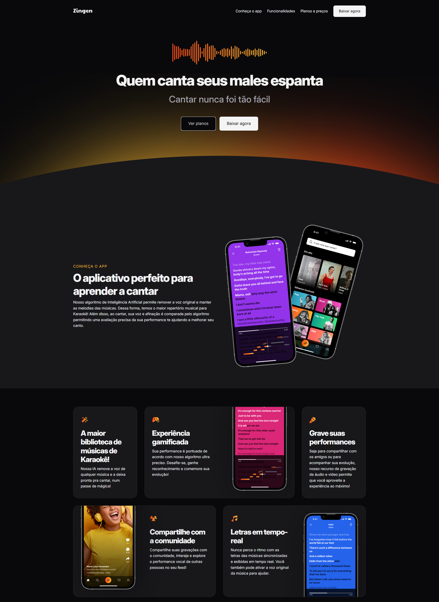
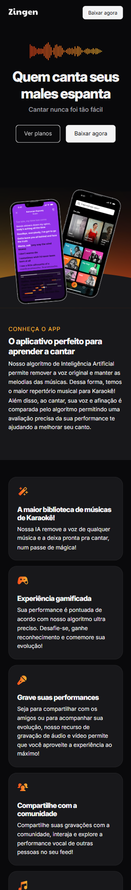

# 🎤 Zingen | Landing Page para App de Karaokê com IA

Projeto desenvolvido como parte do meu aprendizado em **desenvolvimento Frontend**, com foco em **HTML**, **CSS** e boas práticas de **responsividade** e **design visual**. Esta landing page apresenta o **Zingen**, um app fictício de karaokê que utiliza inteligência artificial para oferecer uma nova experiência musical.

---

## 🚀 Sobre o Projeto

O objetivo foi criar uma interface moderna, responsiva e interativa que simulasse uma landing page real de produto digital. Ideal para treinar estruturação de layouts e boas práticas de semântica.

🔗 [Acesse a página](https://nikolasmarlon.github.io/Zingen)

---

## 💻 Tecnologias Utilizadas

- **HTML5** — Estrutura semântica
- **CSS3** — Layout responsivo, grid, flexbox
- **Figma (design base)** — Referência visual

---

## 🧠 O que desenvolvi aqui

- Estudo e aplicação de design responsivo (mobile-first)
- Organização e reutilização de classes no CSS
- Boas práticas de acessibilidade e semântica
- Experiência com deploy no GitHub Pages

---

## 📸 Visual do Projeto

| Desktop                      | Mobile                    |
|-----------------------------|---------------------------|
| |  |

---

